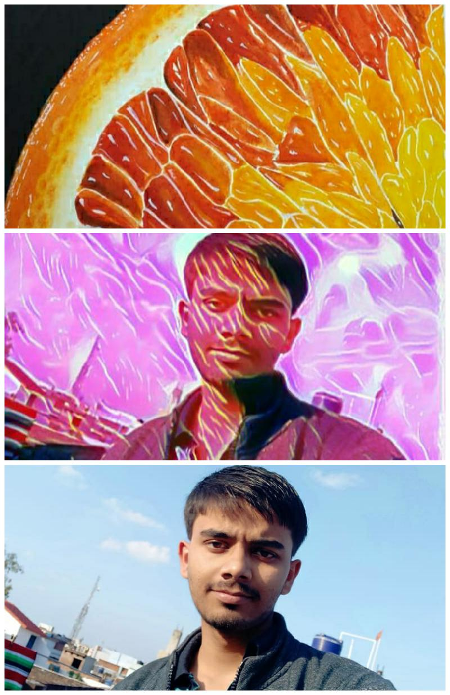
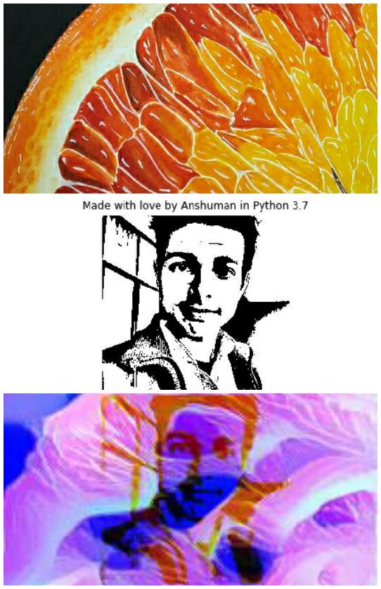

<h3> Implemented [this](https://arxiv.org/abs/1508.06576) Research Paper on Style Transfer Using Deep Neural Network <h3>

<B>Collage 1</B>

<B>Collage 2</B>

  

  
<B><I>The repository contains implementation in</I></B>
    
    TensorFlow 1.x
    
    PyTorch 1.4
  

<I>Code is available as Jupyter-Notebook and .py formats</I>

<B><I>Special thanks to:</I></B>
  
  <B>Nishka Pandya</B>
  <I>for Style Image (Orange)</I>
 
 
<h3> Wanna one photo of yours like above ? </h3>

Reach out to me :

  
[Instagram](https://www.instagram.com/kanpuriyanawab/)

[LinkedIn](https://www.linkedin.com/in/anshuman-mishra-89b014195)

  

  
